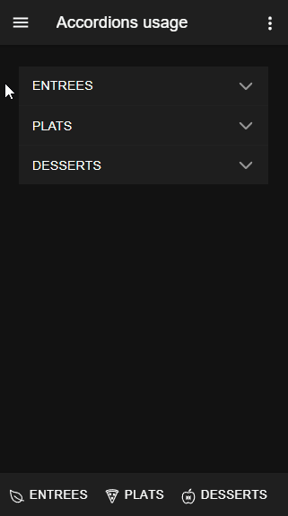

#  accordion

How to use Accordions

<i>Connectors</i>
<blockquote>

<b>HTTP_connector</b>
<blockquote>

##  HTTP_connector

<i>Transactions</i>
<blockquote>

<b>Default_transaction</b>
<blockquote>

###  Default_transaction

</blockquote>

<b>JSON_HTTP_transaction</b>
<blockquote>

###  JSON_HTTP_transaction

</blockquote>

</blockquote>

</blockquote>

<b>void</b> : void connector, replace or don't use it
<blockquote>

##  void

void connector, replace or don't use it

<i>Transactions</i>
<blockquote>

###  void

does nothing

</blockquote>

</blockquote>

</blockquote>

<i>Sequences</i>
<blockquote>

##  get_data

</blockquote>

<i>Mobile Application</i>
<blockquote>

##  Application

Describes the mobile application global properties

<i>Pages</i>
<blockquote>

###  Page

<ul>
<li>NGX Accordions</li>
</ul>
 

</blockquote>

</blockquote>

