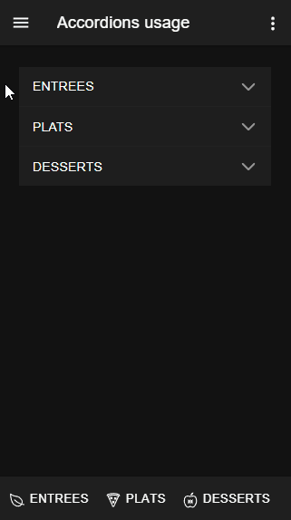

# accordion

How to use Accordions


For more technical informations : [documentation](./project.md)

- [Installation](#installation)
- [Mobile Application](#mobile-application)
    - [Pages](#pages)
        - [Page](#page)


## Installation

1. In your Convertigo Studio use `File->Import->Convertigo->Convertigo Project` and hit the `Next` button
2. In the dialog `Project remote URL` field, paste the text below:
   <table>
     <tr><td>Usage</td><td>Click the copy button</td></tr>
     <tr><td>To contribute</td><td>

     ```accordion=C:/Convertigo/Studio 8.1.0/workspace/accordion/.git:branch=master```

     </td></tr>
     <tr><td>To simply use</td><td>
     
     ```accordion=C:/Convertigo/Studio 8.1.0/workspace/accordion//archive/master.zip```
     
     </td></tr>
    </table>
3. Click the `Finish` button. This will automatically import the accordion project


## Mobile Application

Describes the mobile application global properties

### Pages

#### Page

<ul>
<li>NGX Accordions</li>
</ul>
<br/>



